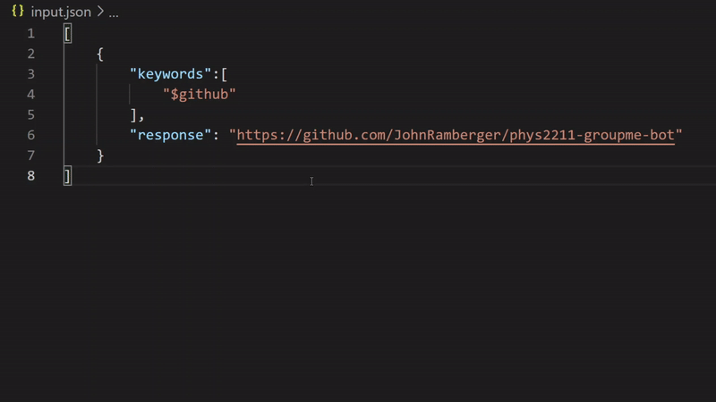

# phys2211-groupme-bot
 A chatbot for the [`Physics 2211 - Section M`](https://groupme.com/join_group/70009643/mNR0uhnD) GroupMe

 <br>

 ## how does it work?
 Just type one of the commands into the GroupMe, and prof. Fenton (definately the real one) will respond with some knowledge.

<br>

 ## how can I add commands to this bot? 
 The [`input.json`](./input.json) file holds all of the commands for the bot in JSON format. To add a new command, simply copy/paste an existing command and change it to fit your needs, and submit the change through a GitHub pull request (or msg me on GroupMe and I'll do it for you). 

<br>

 ### **Don't forget to add commas where necessary, JSON is very strict**

<br>

 # Examples
 
 input.json changes from:

 ```json
[
    {
        "keywords":[
            "$github"
        ],
        "response": "https://github.com/JohnRamberger/phys2211-groupme-bot"
    }
]
 ```
to:
 ```json
 [
    {
        "keywords":[
            "$github"
        ],
        "response": "https://github.com/JohnRamberger/phys2211-groupme-bot"
    },
    {
        "keywords":[
            "$keyword",
            "$another keyword",
            "$maybe another keyword?",
            "$as many keywords as you want"
        ],
        "response": "text sent back by the bot in GroupMe"
    }
]
```

gif: 

 
